# Digital Farm Tracking -- Data Model

**Solution:** Digital Farm Tracking
**Publisher Prefix:** `inv_`
**Version:** 2.2.0.0
**Tables:** 19

---

## Entity Relationship Diagram

```mermaid
erDiagram
    Shadehouse ||--o{ Batch : houses
    Batch ||--o{ Bed : contains
    Season ||--o{ Batch : groups

    Season ||--o{ Planting : "growing period"
    Plant ||--o{ PlantPrice : "priced at"
    Season ||--o{ PlantPrice : "valid during"
    Plant ||--o{ Planting : "planted as"
    Bed ||--o{ Planting : "grows in"

    Planting ||--o{ Treatment : receives
    Planting ||--o{ Irrigation : receives
    Planting ||--o{ Harvest : yields

    Input ||--o{ Treatment : "applied via"

    Planting ||--o{ Task : "related to"
    Bed ||--o{ Task : "related to"

    Customer ||--o{ Order : places
    Order ||--o{ OrderItem : contains
    Plant ||--o{ OrderItem : "ordered as"

    Order ||--o{ Packing : "fulfilled by"
    Plant ||--o{ Packing : "variety"
    Bed ||--o{ Packing : "sourced from"
    Shadehouse ||--o{ Packing : "sourced from"
    Invoice ||--o{ Packing : "invoiced in"

    Customer ||--o{ Invoice : "billed to"
    FiscalAuthorization ||--o{ Invoice : "authorizes"

    Shadehouse {
        string ShadehouseName PK
        string Code
        string Location
        string Coordinates
        decimal Length_m
        decimal Width_m
        int Capacity_beds
        boolean IsActive
    }

    Batch {
        string BatchCode PK
        lookup ShadehouseId FK
        lookup SeasonId FK
        string Position
        memo Notes
    }

    Bed {
        string BedName PK
        lookup BatchId FK
        choice Type
        choice Level
        int Capacity
        choice BedMaterial
        choice SoilType
        choice Drainage
        choice IrrigationType
        string Location
        boolean IsActive
    }

    Plant {
        string PlantName PK
        string PlantCode
        string LatinName
        string Species
        string Variety
        string Origin
        string PatentNumber
        string PatentHolder
        date PatentExpiry
        boolean IsPatented
        choice GrowthHabit
        choice PropagationMethod
        choice SunlightRequirement
        choice WaterRequirement
        choice SoilType
        string BloomPeriod
        currency DefaultUnitPrice
        memo Characteristics
        string ImageUrl
        boolean IsActive
    }

    PlantPrice {
        string PlantPriceName PK
        lookup PlantId FK
        lookup SeasonId FK
        date EffectiveFrom
        date EffectiveTo
        currency UnitPrice_USD
        boolean IsActive
        memo Notes
    }

    Season {
        string SeasonName PK
        date StartDate
        date EndDate
        memo Description
        boolean IsActive
    }

    Planting {
        string PlantingDescription PK
        lookup PlantId FK
        lookup BedId FK
        lookup SeasonId FK
        date PlantingDate
        int Quantity
        boolean CurrentPlanting
        memo Notes
    }

    Treatment {
        string TreatmentName PK
        lookup PlantingId FK
        lookup InputId FK
        date Date
        choice Type
        decimal TemperatureC
        decimal Humidity
        decimal PH
        string Worker
        memo Notes
    }

    Irrigation {
        string IrrigationName PK
        lookup PlantingId FK
        date Date
        decimal AmountLiters
        choice Method
        memo Notes
    }

    Harvest {
        string HarvestName PK
        lookup PlantingId FK
        date Date
        decimal YieldKg
        int QuantityHarvested
        choice Quality
        string HarvestedBy
        memo Notes
    }

    Input {
        string InputName PK
        choice InputCategory
        string InputSubtype
        string Brand
        memo Composition
        choice ApplicationMethod
        int SafetyIntervalDays
        memo StorageInstructions
        memo EnvironmentalImpact
        string ManufacturerContact
        memo Notes
    }

    Task {
        string TaskTitle PK
        choice TaskType
        lookup PlantingId FK
        lookup BedId FK
        datetime DueDate
        datetime CompletedDate
        choice Status
        choice Priority
        string AssignedTo
        memo Notes
    }

    Calendar {
        string DateLabel PK
        date Date
        string ISODateID
        int Year
        int Quarter
        int MonthNumber
        string MonthLongName
        string MonthShortName
        int WeekNumber
        int DayOfMonth
        int DayOfYear
        int WeekdayNumber
        string WeekdayLongName
        string WeekdayShortName
        string QuarterYear
        boolean IsWeekend
    }

    Customer {
        string CustomerName PK
        string CustomerCode
        string Email
        string Phone
        memo Address
        string TaxId
        string ContactName
        string ContactEmail
        string DeliverToName
        memo DeliverToAddress
        choice PaymentTerms
        memo Notes
        boolean IsActive
    }

    Order {
        string OrderNumber PK
        lookup CustomerId FK
        date OrderDate
        date RequestedDeliveryDate
        choice Status
        currency TotalAmount
        memo Notes
    }

    OrderItem {
        string OrderItemName PK
        lookup OrderId FK
        lookup PlantId FK
        int Quantity
        currency UnitPrice
        currency LineTotal
    }

    Packing {
        string PackingId PK
        string Barcode
        int BoxNumber
        lookup PlantId FK
        lookup BedId FK
        lookup ShadehouseId FK
        lookup OrderId FK
        lookup InvoiceId FK
        choice PackingType
        int BundleSize
        int Quantity
        int GrossWeight
        int NetWeight
        int TotalWeight
        currency UnitPrice
        currency LineTotal
        string PackedBy
        string WorkerId
        choice ProductType
        choice CuttingType
        choice Size
        boolean PackingCompleted
        date PackingDate
    }

    FiscalAuthorization {
        string FiscalAuthName PK
        string CAI
        string RTN
        string RangeStart
        string RangeEnd
        date ExpirationDate
        int TotalAuthorized
        int NextNumber
        date RequestDate
        boolean IsActive
    }

    Invoice {
        string InvoiceNumber PK
        lookup FiscalAuthId FK
        lookup CustomerId FK
        date InvoiceDate
        int WeekNumber
        date ETD
        date ETA
        choice ShippedVia
        string Carrier
        string AWBNumber
        string ContainerNumber
        string SealNumber
        string TempRecord
        choice Terms
        string PortOfEntry
        string PhytoNumber
        string NotifyPartyName
        memo NotifyPartyAddress
        string NotifyPartyContact
        currency Subtotal
        currency ISV15
        currency ISV18
        currency SubtotalExonerated
        currency Discounts
        currency AirFreight
        currency TotalAmount_USD
        decimal ExchangeRate_HNL_USD
        currency TotalAmount_HNL
        currency PaidAmount
        currency Balance
        choice Status
        date DueDate
        string SharePointUrl
        memo Notes
    }
```



---

## Domain Overview

### 1. Infrastructure (Shadehouse, Batch, Bed)

Physical location hierarchy: **Shadehouse > Batch > Bed**.

| Table | Schema Name | Ownership | Description |
|---|---|---|---|
| **Shadehouse** | `inv_Shadehouse` | Organization | Physical growing structures with dimensions and capacity |
| **Batch** | `inv_Batch` | Organization | Production batches within a shadehouse, optionally tied to a season |
| **Bed** | `inv_Bed` | Organization | Growing beds within a batch -- ground or air type, levels 0-3 |

### 2. Plant Catalog (Plant, PlantPrice, Season)

Plant master data with seasonal pricing.

| Table | Schema Name | Ownership | Description |
|---|---|---|---|
| **Plant** | `inv_Plant` | Organization | Species, varieties, patents, growing requirements, and default pricing |
| **PlantPrice** | `inv_PlantPrice` | Organization | Price history per plant per season with effective date ranges |
| **Season** | `inv_Season` | Organization | Growing season periods (start/end dates) |

### 3. Operations (Planting, Treatment, Irrigation, Harvest, Input, Task, Calendar)

Day-to-day nursery activities. Planting is the central hub linking Plant + Bed + Season.

| Table | Schema Name | Ownership | Description |
|---|---|---|---|
| **Planting** | `inv_Planting` | Organization | Central hub -- what Plant is in which Bed during which Season |
| **Treatment** | `inv_Treatment` | Organization | Fumigation/pest control applications to plantings using inputs |
| **Irrigation** | `inv_Irrigation` | Organization | Watering events with volume and method |
| **Harvest** | `inv_Harvest` | Organization | Yield and quality tracking per planting |
| **Input** | `inv_Input` | Organization | Catalog of fertilizers, pesticides, fungicides, and other chemicals |
| **Task** | `inv_Task` | User | Scheduled work items with type, assignment, and priority |
| **Calendar** | `inv_Calendar` | Organization | Date dimension table for reporting and scheduling |

### 4. Commercial (Customer, Order, OrderItem, Packing, FiscalAuthorization, Invoice)

Customer management, order fulfillment, packing, fiscal compliance, and invoicing.

| Table | Schema Name | Ownership | Description |
|---|---|---|---|
| **Customer** | `inv_Customer` | User | Customer records with sold-to and deliver-to addresses |
| **Order** | `inv_Order` | User | Customer orders with status tracking |
| **OrderItem** | `inv_OrderItem` | Organization | Order line items (plant + quantity + unit price) |
| **Packing** | `inv_Packing` | User | Per-box packing records with barcode, weights, product type, cutting type, size, and bundle info |
| **FiscalAuthorization** | `inv_FiscalAuthorization` | Organization | Honduras SAR CAI authorizations -- invoice number ranges and expiration dates |
| **Invoice** | `inv_Invoice` | User | Export invoices with shipping, fiscal, tax, and payment tracking |

---

## Choice Fields Reference

### Bed

| Field | Schema Name | Options |
|---|---|---|
| Type | `inv_Type` | `681340000` Air, `681340001` Ground |
| Level | `inv_Level` | `681340000` 0, `681340001` 1, `681340002` 2, `681340003` 3 |
| Bed Material | `inv_BedMaterial` | `681340000` Wood, `681340001` Concrete, `681340002` Plastic, `681340003` Metal |
| Soil Type | `inv_SoilType` | `681340000` Sandy, `681340001` Loamy, `681340002` Clay, `681340003` Peaty, `681340004` Chalky, `681340005` Silty |
| Drainage | `inv_Drainage` | `681340000` Excellent, `681340001` Good, `681340002` Moderate, `681340003` Poor |
| Irrigation Type | `inv_IrrigationType` | `681340000` Drip, `681340001` Sprinkler, `681340002` Manual, `681340003` None |

### Plant

| Field | Schema Name | Options |
|---|---|---|
| Growth Habit | `inv_GrowthHabit` | `681340000` Upright, `681340001` Spreading, `681340002` Climbing, `681340003` Trailing |
| Propagation Method | `inv_PropagationMethod` | `681340000` Seed, `681340001` Cutting, `681340002` Division, `681340003` Grafting, `681340004` Tissue Culture |
| Sunlight Requirement | `inv_SunlightRequirement` | `681340000` Full Sun, `681340001` Partial Shade, `681340002` Full Shade |
| Water Requirement | `inv_WaterRequirement` | `681340000` Low, `681340001` Medium, `681340002` High |
| Soil Type | `inv_SoilType` | `681340000` Sandy, `681340001` Loamy, `681340002` Clay, `681340003` Peaty, `681340004` Chalky, `681340005` Silty |

### Input

| Field | Schema Name | Options |
|---|---|---|
| Input Category | `inv_InputCategory` | `747480000` Fertilizer, `747480001` Pesticide, `747480002` Fungicide, `747480003` Herbicide, `747480004` Growth Regulator, `747480005` Other |
| Application Method | `inv_ApplicationMethod` | `747480000` Foliar Spray, `747480001` Soil Drench, `747480002` Granular, `747480003` Drip, `747480004` Broadcast, `747480005` Other |

### Treatment

| Field | Schema Name | Options |
|---|---|---|
| Type | `inv_Type` | `747480000` Insecticide, `747480001` Fungicide, `747480002` Herbicide, `747480003` Regulator |

### Irrigation

| Field | Schema Name | Options |
|---|---|---|
| Method | `inv_Method` | `747480000` Drip, `747480001` Sprinkler, `747480002` Manual, `747480003` Flood |

### Harvest

| Field | Schema Name | Options |
|---|---|---|
| Quality | `inv_Quality` | `747480000` Excellent, `747480001` Good, `747480002` Average, `747480003` Poor |

### Task

| Field | Schema Name | Options |
|---|---|---|
| Task Type | `inv_TaskType` | `747480000` Watering, `747480001` Fertilizing, `747480002` Pruning, `747480003` Repotting, `747480004` Pest Control, `747480005` Disease Treatment, `747480006` Harvesting, `747480007` Seeding, `747480008` Packing, `747480009` Inspection, `747480010` General Maintenance |
| Status | `inv_Status` | `747480000` Pending, `747480001` In Progress, `747480002` Done, `747480003` Skipped |
| Priority | `inv_Priority` | `747480000` Low, `747480001` Normal, `747480002` High, `747480003` Urgent |

### Customer

| Field | Schema Name | Options |
|---|---|---|
| Payment Terms | `inv_PaymentTerms` | `747480000` CIF, `747480001` FOB, `747480002` EXW, `747480003` DDP, `747480004` Net 30 |

### Order

| Field | Schema Name | Options |
|---|---|---|
| Status | `inv_Status` | `747480000` Draft, `747480001` Confirmed, `747480002` In Packing, `747480003` Ready for Pickup, `747480004` Delivered, `747480005` Cancelled |

### Packing

| Field | Schema Name | Options |
|---|---|---|
| Packing Type | `inv_PackingType` | `685710000` BNDL (Bundle), `685710001` IND (Individual) |
| Product Type | `inv_ProductType` | `747480000` URC (Unrooted Cutting) |
| Cutting Type | `inv_CuttingType` | `747480000` L/E (Leaf & Eye) |
| Size | `inv_Size` | `747480000` Petit, `747480001` Mini Petit, `747480002` Small, `747480003` Medium, `747480004` California, `747480005` Large, `747480006` Extra Large |

### Invoice

| Field | Schema Name | Options |
|---|---|---|
| Shipped Via | `inv_ShippedVia` | `747480000` Air, `747480001` Sea, `747480002` Land |
| Terms | `inv_Terms` | `747480000` CIF, `747480001` FOB, `747480002` EXW, `747480003` DDP |
| Status | `inv_Status` | `747480000` Draft, `747480001` Sent, `747480002` Partially Paid, `747480003` Paid, `747480004` Overdue, `747480005` Cancelled |

---

## Key Business Flows

### Location Hierarchy

```
Shadehouse -> Batch -> Bed (type: ground/air, levels: 0-3)
```

Every Bed belongs to a Batch, and every Batch belongs to a Shadehouse. This gives full location traceability from any bed back to its physical structure.

### Planting to Harvest

```
Season + Plant + Bed  ->  Planting
                             |
                             +-> Treatment (with Input catalog item)
                             +-> Irrigation (volume + method)
                             +-> Harvest (yield kg + quantity + quality)
                             +-> Task (scheduled work items)
```

**Planting** is the central hub. It links a specific Plant variety to a Bed in a Season. All operational activities (treatments, irrigation, harvests, tasks) reference back to the Planting record for full traceability: Planting -> Bed -> Batch -> Shadehouse.

### Packing to Invoice

```
Customer -> Order -> OrderItem (plant + qty + price)
                |
                +-> Packing (per box)
                       |  plant, bed, shadehouse (source traceability)
                       |  product type (URC), cutting type (L/E), size
                       |  packing type (BNDL/IND), bundle size (3 or 5)
                       |  barcode, weights, packed by, worker ID
                       |
                       +-> Invoice
                              |  fiscal authorization (CAI range)
                              |  shipping (ETD, ETA, carrier, AWB, container, seal)
                              |  tax (ISV 15%, ISV 18%, exonerated, discounts)
                              |  financials (USD total, HNL exchange rate, paid, balance)
                              |  compliance (phytosanitary cert, port of entry)
                              |  notify party (freight forwarder)
```

Each Packing record is one box. Multiple boxes can reference the same Order and Invoice. The Invoice aggregates packing records (typically weekly) and includes full shipping and fiscal details.

### Fiscal Authorization (Honduras SAR)

```
FiscalAuthorization (CAI)
   |  CAI code, RTN, number range (start-end), expiration date
   |  next available number (auto-increment counter)
   |
   +-> Invoice
          invoice number assigned from CAI range (e.g. 000-001-01-00001461)
```

Each FiscalAuthorization record represents a CAI issued by the Honduras tax authority (SAR). It defines a range of valid invoice numbers and an expiration date. The `NextNumber` field tracks the next available invoice number within the authorized range.

### Price Management

```
Plant + Season + date range  ->  PlantPrice (unit price USD)
                                    |
                                    +-> referenced at packing/invoicing time
```

PlantPrice records define the price of a plant variety for a given season and effective date range. When packing, the applicable unit price is looked up from the active PlantPrice record matching the plant, season, and current date. The Plant table also carries a `DefaultUnitPrice` as a fallback.
